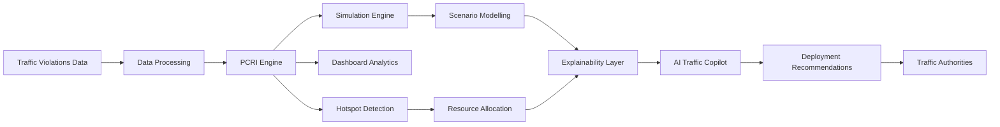

# 🚦 RecLog — AI-Powered Traffic Intelligence & Resource Optimization Platform

> Transforming traffic violations into actionable intelligence.

RecLog is an AI-driven traffic intelligence platform built to help city administrators identify congestion hotspots, forecast future traffic risks, optimize resource deployment, and generate operational strategies using natural language.

Built for **Flipkart Gridlock 2.0**, RecLog addresses one of Bengaluru's most persistent challenges: **parking-induced traffic congestion**.

---

## 🌟 Problem Statement

Bengaluru is among the world's most congested cities, with commuters losing significant hours annually due to traffic delays.

A major contributor is **illegal and unregulated parking**, which:

* Reduces effective road capacity
* Creates bottlenecks near junctions
* Blocks transit hubs and metro stations
* Delays emergency response vehicles
* Increases congestion ripple effects across the network

Current enforcement systems are largely reactive and depend heavily on manual monitoring.

---

# 💡 Our Solution

RecLog converts raw traffic violation data into intelligent operational recommendations.

The platform enables authorities to:

✅ Identify high-risk congestion hotspots

✅ Prioritize risk using PCRI

✅ Prioritize interventions using a custom risk index

✅ Simulate future traffic conditions

✅ Optimize deployment of officers and tow trucks

✅ Generate AI-powered action plans

✅ Explain recommendations transparently

---

## 📸 Platform Showcase

### Traffic Intelligence Dashboard

 <table>
  <tr>
    <td width="50%">
      
    </td>
    <td width="50%">
      
    </td>
  </tr>
</table>
      

*Real-time city-wide traffic monitoring with KPI cards, congestion analytics, root-cause analysis, and live incident feeds.*

---

### Geospatial Hotspot Intelligence
<table>
<tr>
</tr>
</table>


*Interactive H3-powered hotspot visualization with PCRI risk scoring and congestion prioritization.*

---

### AI Traffic Copilot


*Natural-language decision support for resource allocation and operational planning.*

---

### What-If Impact Simulator

<table>
  <tr>
    <td width="50%">
      
    </td>
    <td width="50%">
      
    </td>
  </tr>
  <tr>
    <td colspan="2" width="100%">
      
    </td>
  </tr>
</table>


*Evaluate traffic interventions and forecast congestion reduction before deployment.*

---

# 🏗️ RecLog Architecture



# 🧠 Priority Congestion Risk Index (PCRI)

At the heart of RecLog lies the **Priority Congestion Risk Index (PCRI)**.

Unlike traditional approaches that only count violations, PCRI evaluates multiple dimensions of traffic risk.

### PCRI Factors

| Component          | Weight |
| ------------------ | ------ |
| Spatial Density    | 35%    |
| Violation Severity | 20%    |
| Vehicle Impact     | 15%    |
| Repeat Offenders   | 15%    |
| Road Criticality   | 15%    |

### Output

PCRI generates a score between **0 and 100**.

Higher PCRI indicates:

* Greater congestion risk
* Higher enforcement priority
* Increased resource requirements

---

# 📊 Features

## 1️⃣ Real-Time Traffic Intelligence Dashboard

Provides a city-wide operational overview including:

* Total Hotspots
* Critical Hotspots
* Traffic Violations
* Average PCRI
* Weekly Violation Trends
* Root Cause Analysis
* Live Incident Feed

---

## 2️⃣ Geospatial Hotspot Mapping

Powered by H3 indexing and interactive GIS visualization.

Features:

* Interactive hotspot map
* Severity-based risk coloring
* Location-specific telemetry
* Critical area identification

---

## 3️⃣ Semantic Hotspot Search

Instantly search and filter hundreds of hotspots.

Capabilities:

* Fuzzy matching
* Real-time filtering
* Fast pagination
* Risk-based sorting

---

## 4️⃣ AI Traffic Copilot

Interact with traffic intelligence using natural language.

### Example Query

"I have 20 officers and 3 tow trucks. Where should I deploy them on a rainy Friday?"

### AI Output

* Priority hotspot ranking
* Officer allocation plans
* Tow truck deployment schedules
* Predicted congestion reduction

---

## 5️⃣ Resource Allocation Engine

Automatically converts PCRI scores into deployment recommendations.

| Risk Tier | Officers | Tow Trucks | Patrol Frequency |
| --------- | -------- | ---------- | ---------------- |
| Critical  | 6        | 3          | Every 15 min     |
| High      | 4        | 2          | Every 30 min     |
| Medium    | 2        | 1          | Every 1 hour     |
| Low       | 1        | 0          | Every 4 hours    |

---

## 6️⃣ What-If Impact Simulator

Evaluate interventions before deploying resources.

Supported Scenarios:

* Normal Conditions
* Rain
* Festival Traffic
* Extra Enforcement
* Traffic Diversion

Outputs:

* Predicted violations
* Projected PCRI
* Reduction efficiency
* Confidence score

---

# 🔍 Explainable AI Simulator

Traffic authorities need **trust before they act**.

RecLog's Explainability Layer ensures that every recommendation generated by the platform can be understood, validated, and justified.

For every simulation, the system provides:

- 📌 Key congestion drivers
- 🌧️ Impact of environmental conditions
- 🚓 Resource allocation rationale
- 📊 PCRI component contribution
- ✅ Confidence score

### Example Simulation Explanation

#### PCRI Increased Due To

- High violation density (**+32%**)
- Heavy vehicle concentration (**+18%**)
- Repeat offender activity (**+11%**)

#### Recommended Action

- Deploy **4 Traffic Officers**
- Deploy **2 Tow Trucks**
- Increase patrol frequency

#### Confidence Score

**87%**

> This transforms the simulator from a black-box prediction engine into an explainable decision-support system.

---

# 🎯 Key Innovations

## 🧠 Priority Congestion Risk Index (PCRI)

A custom congestion scoring framework that evaluates traffic risk beyond raw violation counts by incorporating:

- Spatial Density
- Violation Severity
- Vehicle Impact
- Repeat Offenders
- Road Criticality

---

## 🔍 Explainable AI Simulator

Forecasts intervention outcomes while clearly explaining:

- Why congestion levels change
- Which factors contributed most
- How recommendations were generated
- Expected confidence in predictions

---

## 🤖 AI Traffic Copilot

Converts natural-language queries into actionable deployment strategies.

**Example Query**

> "I have 20 officers and 3 tow trucks. Where should I deploy them on a rainy Friday evening?"

**Output**

- Priority hotspot ranking
- Officer allocation plan
- Tow truck deployment strategy
- Predicted congestion reduction

---

## 🗺️ Geospatial Risk Intelligence

Uses **Uber H3 Spatial Indexing** to:

- Identify high-risk zones
- Visualize congestion hotspots
- Prioritize enforcement regions
- Enable location-aware decision making

---

## ⚙️ Resource Optimization Engine

Transforms congestion risk into operational recommendations through:

- Dynamic officer allocation
- Tow truck deployment planning
- Patrol frequency optimization
- Risk-based intervention strategies

---

# 🤖 AI Components

## AI Traffic Copilot

- Llama 3.1
- Groq API
- Natural Language Planning
- Context-Aware Recommendations

---

## Predictive Simulation Engine

- Scenario Modeling
- Forecasting Engine
- Risk Projection
- Intervention Analysis

---

## Explainable Decision Intelligence

- Recommendation Justification
- PCRI Breakdown Analysis
- Confidence Estimation
- Resource Allocation Reasoning
- Congestion Driver Analysis

---

## Decision Pipeline

```text
Traffic Data
      │
      ▼
PCRI Risk Scoring
      │
      ▼
Simulation Engine
      │
      ▼
Explainability Layer
      │
      ▼
AI Traffic Copilot
      │
      ▼
Deployment Recommendations
```

> **Most systems tell you where the problem is. RecLog tells you what to do about it.**

---

# ⚙️ Tech Stack

### Frontend

* React
* Vite
* TailwindCSS
* React Leaflet
* Recharts

### Backend

* FastAPI
* Pydantic
* Pandas
* NumPy
* Scikit-Learn

### AI

* Groq
* Llama 3.1

### Geospatial

* OpenStreetMap
* H3 Spatial Indexing

---

# 📈 Impact

RecLog enables:

* Faster hotspot identification

* Smarter resource utilization

* Reduced traffic congestion

* Data-driven enforcement

* Predictive traffic planning

* Improved incident response

* Explainable decision-making 

---

# 🔮 Future Roadmap

* Live CCTV Integration
* IoT Traffic Sensors
* Computer Vision-Based Violation Detection
* Reinforcement Learning Optimization
* Congestion Forecasting Models
* Smart City Integration
* Multi-CIty Deployment Support

---

# 🚀 Getting Started

## Clone Repository

```bash
git clone <repo-url>
cd RecLog
```

## Backend Setup

```bash
cd backend

python -m venv venv

venv\Scripts\activate

pip install -r requirements.txt

uvicorn main:app --reload
```

## Frontend Setup

```bash
cd frontend

npm install

npm run dev
```

---

# 👥 Team
Zion
* Rishik Garg
* Disha Kaushal
* Trisha Soni
* Shresth Agarwal

Built for Flipkart Gridlock 2.0

RecLog — From Traffic Data to Smarter Decisions.
